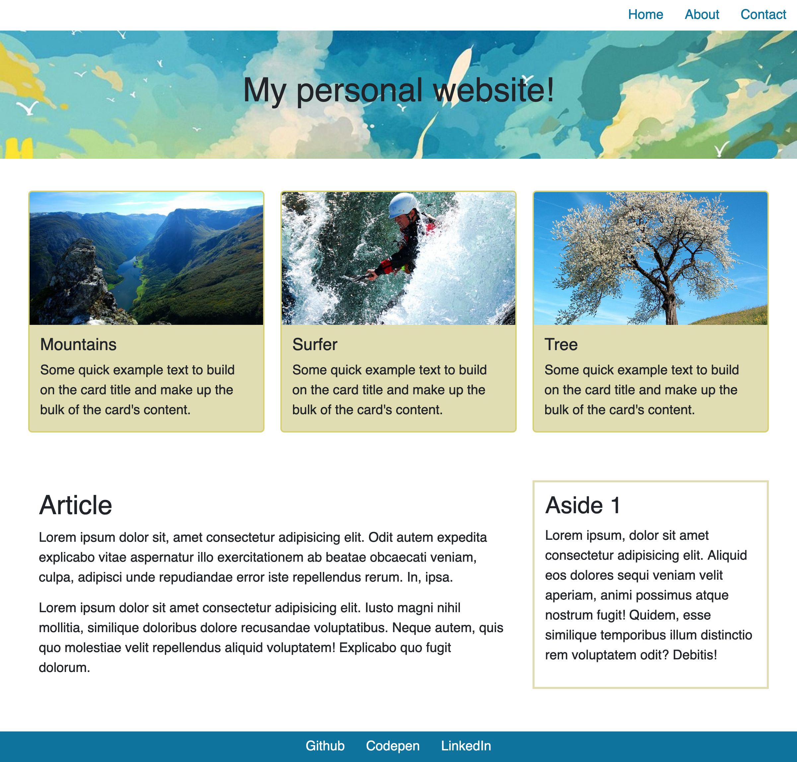

# Sassy Website

Dein Endziel ist es, eine Mockup-Website zu erstellen, wie sie im [Referenzbildordner](./images_reference) zu sehen ist.

Diese Seite hat bereits ein wenig Arbeit daran getan, es ist ein bisschen so, als würdest du ein älteres Projekt "erben" und musst von der Arbeit anderer aus weitermachen. Du kannst jedes HTML und SCSS behalten oder ändern, wie du möchtest!

## Anleitung

* Führe `npm install` im Stammverzeichnis aus, um alle notwendigen Abhängigkeiten herunterzuladen.
* Danach verwende einfach den Befehl `npm run start` aus dem Stammverzeichnis, um `SCSS` zu kompilieren und den Live-Server automatisch zu starten.
* Der Startcode befindet sich im Ordner `src`. Ändere beliebige vorhandene Dateien oder füge bei Bedarf neue hinzu.
* Schreibe deine Styles mit `SCSS`.
* Nutze nesting und Variablen, wo es möglich ist.
* Achte darauf, dass du zuerst für Mobilgeräte designst!

## Aufgabe 1

Das Projekt, so wie du es erhalten hast, verwendet die Standardfarben und Schriftarten von Bootstrap.

Insbesondere musst du die `primary` und `secondary` Farbe und die Basis `font family` mit diesen neuen Werten ändern:

- Hauptfarbe: `#0e749e`
- Sekundärfarbe: `#e0ddb2`

Die Bootstrap-Variablen sind:

- `$primary`: für die Hauptfarbe
- `$secondary`: für die Sekundärfarbe

Füge diese Variablen in eine `_variables.scss` Datei ein und importiere sie in die vorhandene `main.scss`

**WICHTIG**: Denke daran, dass die Datei vor Bootstrap importiert werden muss, um die Bootstrap-Variablen zu überschreiben

## Aufgabe 2

Setze die Anpassung der Standard-Bootstrap-Variablen fort, indem du die Basis-Schriftfamilie und -größe änderst.

Die neuen Werte, die du verwenden musst, sind:

- Basis-Schriftfamilie: `Helvetica, Arial, sans-serif`
- Basis-Schriftgröße: `1.25rem`

Die Bootstrap-Variablen zum Ändern sind:

- `$font-family-base`: für die Schriftfamilie
- `$font-size-base`: für die Schriftgröße

## Aufgabe 3

Es ist Zeit, die 3 Karten direkt nach dem Hero-Bereich oben auf der Seite anzupassen.

Du musst die Hintergrundfarbe, die Rahmenbreite und die Rahmenfarbe ändern.

Die neuen Werte, die du verwenden musst, sind:

- Kartenhintergrundfarbe: die `secondary` Farbe, die du in Aufgabe 1 hinzugefügt hast
- Rahmenfarbe: `#d7d06e`
- Rahmenbreite: `2px`

Die Bootstrap-Variablen zum Überschreiben sind:

- `$card-bg`: für den Kartenhintergrund
- `$card-border-color`: für die Rahmenfarbe
- `$card-border-width`: für die Rahmenbreite

## Aufgabe 4

Du hast Bootstrap angepasst, aber die Seite braucht noch etwas Arbeit.

Deine Aufgabe ist es, die obere Navigation bis zum großen `lg` Breakpoint zentriert zu halten. Ab dem `lg` Breakpoint sollte die Navigation rechts ausgerichtet sein.

Ändere die `index.html` und füge die verfügbaren Bootstrap-Klassen hinzu.

Schau dir die Screenshots unten als Referenz an.

## Aufgabe 5

Du musst ein Hintergrundbild zum `header` oben auf der Seite hinzufügen.

Stelle sicher, dass der Hintergrund den gesamten verfügbaren Platz einnimmt und dass das Bild bei jeder Bildschirmgröße das richtige Seitenverhältnis hat.

Füge deine Styles in eine separate `_style.scss` Datei ein und stelle sicher, dass du sie importierst.

## Aufgabe 6

Nachdem du sichergestellt hast, dass der Hintergrund korrekt funktioniert, verwende die verfügbaren Bootstrap-Klassen, um den Titel im Header sowohl vertikal als auch horizontal zu zentrieren.

## Aufgabe 7

Zurück zum Kartenbereich, die Bilder haben unterschiedliche Höhen.

Füge einen Stil hinzu, um sicherzustellen, dass jedes Bild innerhalb eines `card` Elements eine Höhe von `200px` hat und stelle sicher, dass es bei jeder Bildschirmgröße das richtige Seitenverhältnis hat.

## Aufgabe 8

Verwende die verfügbaren Bootstrap-Klassen, um dem `aside` Element einen Rahmen hinzuzufügen und ändere seine Farbe in die `secondary` Farbe.

Danach füge sowohl dem `article` als auch dem `aside` Klassen hinzu, um etwas Padding hinzuzufügen.

## Aufgabe 9

Verwende die verfügbaren `nav` Bootstrap-Klassen, um die Links im Footer so aussehen zu lassen wie die oben auf der Seite. Stelle sicher, dass sie immer zentriert sind, bei jeder Bildschirmgröße.

## Aufgabe 10

Ändere die Hintergrundfarbe des Footers in die `primary` Farbe.

Danach ändere die Farbe der Links im Footer in Weiß.

## Aufgabe 11

Verwende die verfügbaren Bootstrap-Klassen, um den Containern etwas Abstand hinzuzufügen.

## Aufgabe 12

In Bootstrap gibt es eine Utility-Klasse `vh-100`, die die Höhe eines Elements auf `100vh` setzt

Erstelle eine neue Klasse `vh-30`, die die Höhe auf `30vh` setzt. Füge diese Klasse dem `header` hinzu.

## Referenz

* Verwende die Bilder im Ordner [images](./src/images) für die Kopfzeile und die Karten.

### Mobile Ansicht

### Tablet Ansicht

### Desktop Ansicht

